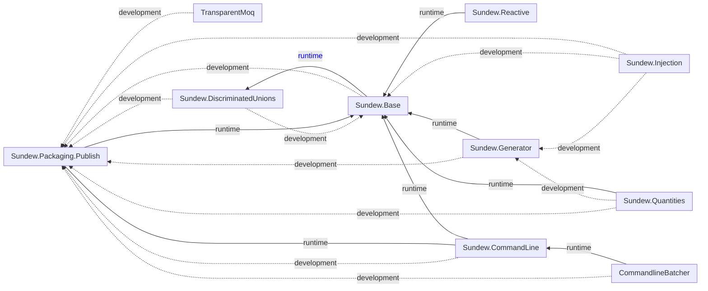

# builds

| **Projects**                                                                                            | Status                                                                                                                                                                                                    | Packages                                                                      | Actions                                                                                   |
| ------------------------------------------------------------------------------------------------------- | --------------------------------------------------------------------------------------------------------------------------------------------------------------------------------------------------------- | ----------------------------------------------------------------------------- | ----------------------------------------------------------------------------------------- |
| [Sundew.Base](https://github.com/sundews/Sundew.Base)                                                   |                           |                           | [GitHub Actions](https://github.com/sundews/Sundew.Base/actions)                          |
| [Sundew.Injection](https://github.com/sundews/Sundew.Injection)                                         |                      |                      | [GitHub Actions](https://github.com/sundews/Sundew.Injection/actions)                     |
| [Sundew.CommandLine](https://github.com/sundews/Sundew.CommandLine)                                     |                    |                    | [GitHub Actions](https://github.com/sundews/Sundew.CommandLine/actions)                   |
| [Sundew.DiscriminatedUnions](https://github.com/sundews/Sundew.DiscriminatedUnions)                     |            |            | [GitHub Actions](https://github.com/sundews/Sundew.DiscriminatedUnions/actions)           |
| [Sundew.Packaging.Publish/Tool](https://github.com/sundews/Sundew.Packaging)                            |                      |              | [GitHub Actions](https://github.com/sundews/Sundew.Packaging/actions)                     |
| [CommandlineBatcher](https://github.com/sundews/CommandlineBatcher)                                     |                    |                    | [GitHub Actions](https://github.com/sundews/CommandlineBatcher/actions)                   |
| [Sundew.Generator](https://github.com/sundews/Sundew.Generator)                                         |                      |                      | [GitHub Actions](https://github.com/sundews/Sundew.Generator/actions)                     |
| [Sundew.Quantities](https://github.com/sundews/Sundew.Quantities)                                       |                     |                     | [GitHub Actions](https://github.com/sundews/Sundew.Quantities/actions)                    |
| [Sundew.Testing](https://github.com/sundews/Sundew.Testing)                                             |                        |                        | [GitHub Actions](https://github.com/sundews/Sundew.Testing/actions)                       |
| [TransparentMoq](https://github.com/sundews/Sundew.Reactive)                                             |                        |                        | [GitHub Actions](https://github.com/sundews/Sundew.Reactive/actions)                       |
| [TransparentMoq](https://github.com/sundews/TransparentMoq)                                             |                        |                        | [GitHub Actions](https://github.com/sundews/TransparentMoq/actions)                       |

### Repository Dependencies

